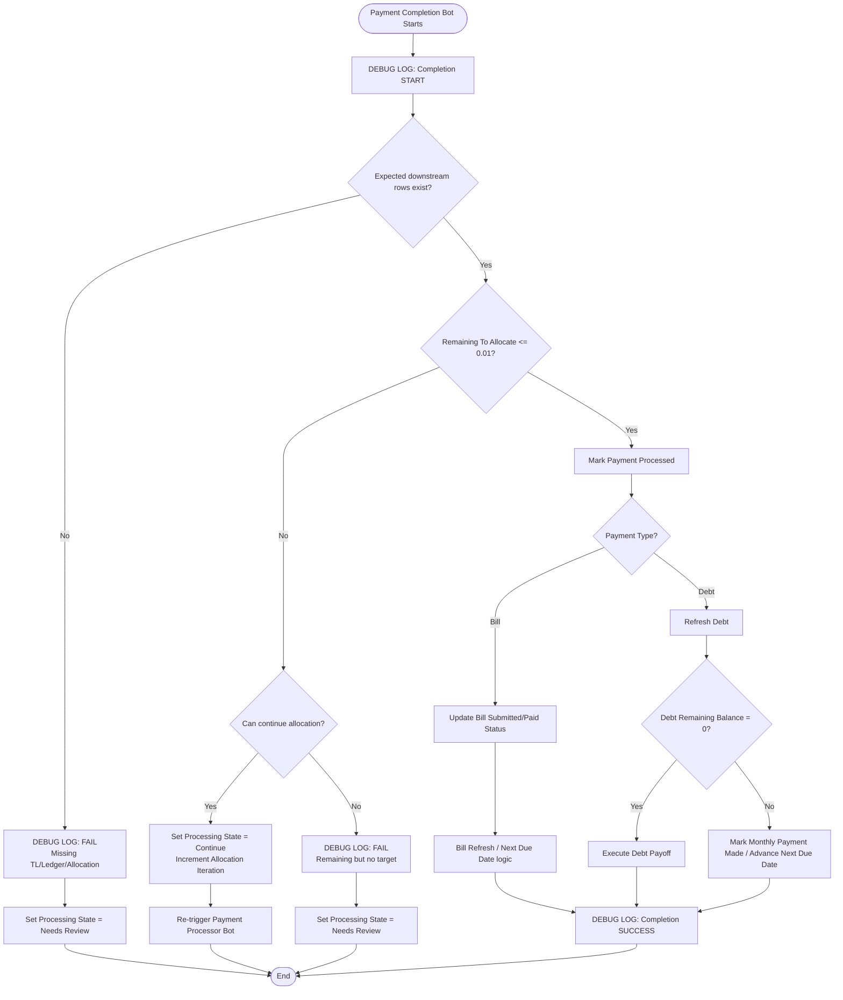

# 🤖 payment-completion-bot.md

> Last Updated: 2026-06-18
>
> Related Docs:
>
> - [payment-processor-bot.md](./payment-processor-bot.md)
> - [pmt-allocation-bot.md](./pmt-allocation-bot.md)
> - [ledger-system.md](../architecture/ledger-system.md)
> - [payment-allocation-process.md](./payment-allocation-process.md)
> - [transaction-links.md](../tables/transaction-links.md)
> - [bill-charges.md](../tables/bill-charges.md)
> - [payments.md](../tables/payments.md)
> - [ledger.md](../tables/ledger.md)

---

# 📌 Overview

## Purpose

The `Payment Completion Bot` is the companion bot to `Payment Processor Bot`.

Its job is to inspect a payment after an allocation attempt and decide whether the payment is:

```text
Complete
```

or:

```text
Still needs another processor loop
```

This bot does not create the primary allocation row.

Instead, it controls the loop state, status updates, finalization, and repair visibility.

---

# 🧠 Design Philosophy

<details open>
<summary><strong>Expand Design Notes</strong></summary>

The `Payment Processor Bot` creates one allocation work item.

The `Payment Completion Bot` decides what happens after that work item exists.

This keeps the CashSnap payment loop clean:

```text
Processor = do one allocation
Completion = decide complete vs continue
LedgerBot / Pmt Allocation Bot = write financial truth
```

---

## Completion Philosophy

A payment should be marked processed only when its allocation is complete and the downstream financial records exist.

For bill payments, completion means:

```text
Payment amount has been fully allocated to Transaction Links
AND
Ledger-backed Bill Charge balances reconcile
```

For debt payments, completion means:

```text
Payment allocations / debt refresh actions are complete
AND
Debt balances reconcile
```

---

## Loop Control Philosophy

This bot should update a physical field when another loop is needed.

Recommended loop-control fields:

```text
Processing State
Allocation Iteration
Processor Tick
Last Completion Check At
Completion Status
```

This avoids relying on virtual column changes to trigger automation.

---

## Ledger SSOT Philosophy

Because CashSnap is moving toward Ledger-as-source-of-truth:

```text
Ledger[Signed Amount]
```

is the balance authority.

Completion should validate downstream ledger existence before marking payment fully processed.

---

## Ownership Boundary

| System | Responsibility |
|---|---|
| Payment Processor Bot | Creates next allocation unit |
| Payment Completion Bot | Determines complete vs continue |
| Transaction Links | Bill-side allocation detail |
| LedgerBot | Bill-side ledger creation |
| PaymentAllocations | Debt-side allocation detail |
| Pmt Allocation Bot | Debt-side ledger and charge processing |
| Bills / Debts | Status updates after completion |
| Ledger | Financial source of truth |

</details>

---

# ⚙️ Trigger Configuration

<details open>
<summary><strong>Trigger Details</strong></summary>

## Event Type

```text
Updates Only
```

---

## Table

```text
Payments
```

---

## Recommended Bot Condition

```appsheet
AND(
  [Processed] <> TRUE,
  [Amount Paid] > 0,
  OR(
    [Processing State] = "Check Completion",
    [Processing State] = "Allocation Created",
    [Processing State] = "Continue",
    ISNOTBLANK([Last Allocation Attempt At])
  ),
  NOT(
    IN(
      [Payment Status],
      LIST(
        "Returned",
        "Reversed",
        "Reversal"
      )
    )
  )
)
```

---

## No Physical Processing State Version

Use this only if the app does not yet have physical loop-control columns:

```appsheet
AND(
  [Processed] <> TRUE,
  [Amount Paid] > 0,
  OR(
    [Remaining To Allocate] <= 0,
    [Remaining To Allocate] > 0
  )
)
```

This condition is intentionally broad and should be replaced with physical state once available.

---

## Completion Branch Condition

```appsheet
[Remaining To Allocate] <= 0.01
```

---

## Continue Branch Condition

```appsheet
AND(
  [Remaining To Allocate] > 0.01,
  OR(
    AND(
      [Type] = "Bill",
      ISNOTBLANK([Next Bill Charge ID])
    ),
    [Type] = "Debt"
  )
)
```

---

## Failure Branch Condition

```appsheet
AND(
  [Remaining To Allocate] > 0.01,
  [Type] = "Bill",
  ISBLANK([Next Bill Charge ID])
)
```

</details>

---

# 🗂️ Tables Used

| Table | Purpose |
|---|---|
| Payments | Source payment and processing state |
| Transaction Links | Bill-side allocation detail |
| Ledger | Ledger-backed validation |
| Bill Charges | Remaining balance validation |
| Bills | Bill status updates |
| Debts | Debt status and payoff updates |
| PaymentAllocations | Debt-side allocation validation |
| Statements | Statement context validation |
| Debug Log | Completion / loop / failure trace |

---

# 🔗 Related Actions

<details open>
<summary><strong>Expand Actions</strong></summary>

## Core Actions

- `Log Payment Completion Start`
- `Check Allocation Completeness`
- `Set Processing State Complete`
- `Set Processing State Continue`
- `Increment Allocation Iteration`
- `Refresh Payment`
- `Mark Payment Processed`
- `Log Payment Completion Finish`

---

## Bill Completion Actions

- `Mark Bill Payment Submitted`
- `Update Bill Status`
- `Mark Bill Paid If Remaining Is Zero`
- `Bill Refresh`
- `Advance Next Due Date`

---

## Debt Completion Actions

- `Refresh Debt`
- `Mark Monthly Payment Made`
- `Advance Debt Next Due Date`
- `Execute Debt Payoff`
- `Repair Statement Link`

---

## Failure / Repair Actions

- `Log Stuck Payment`
- `Log Missing Transaction Link Ledger`
- `Log Missing Next Bill Charge`
- `Clear Processing State`
- `Send To Manual Review`

</details>

---

# 🔄 High-Level Flow

<details open>
<summary><strong>Process Flow</strong></summary>

```text
Payment updated after allocation attempt
    ↓
Log completion check
    ↓
Validate downstream allocation / ledger rows
    ↓
Check Remaining To Allocate
    ↓
If remaining <= tolerance:
        mark payment processed
        update bill/debt status
        log complete
    ↓
If remaining > tolerance and next target exists:
        update loop-control field
        re-trigger Payment Processor Bot
        log continue
    ↓
If remaining > tolerance and no target exists:
        log fail / stuck
        leave unprocessed for repair
```

</details>

---

# 🧩 Mermaid Diagram

<details open>
<summary><strong>Expand Mermaid Diagram</strong></summary>



</details>

---

# 🧾 Step-by-Step Breakdown

<details open>
<summary><strong>Expand Detailed Steps</strong></summary>

# Step 1 — Bot Start

## Action

```text
Log Payment Completion Start
```

Purpose:

- record payment state after allocation attempt
- capture remaining amount
- capture related row counts
- capture current processing state

---

# Step 2 — Validate Downstream Records

For bill payments, validate:

```text
Transaction Link exists for the latest processor attempt
Ledger row exists for the Transaction Link
```

For debt payments, validate:

```text
PaymentAllocation exists when debt allocation is required
Ledger row exists for allocation-driven financial effect
```

Completion should not mark a payment processed if the allocation row exists but the ledger row is missing.

---

# Step 3 — Check Remaining Amount

## Complete

```appsheet
[Remaining To Allocate] <= 0.01
```

If true:

- mark payment processed
- clear processing state
- update bill/debt status
- log success

---

## Continue

```appsheet
[Remaining To Allocate] > 0.01
```

If true and another valid target exists:

- leave `[Processed]` as `FALSE`
- update physical loop-control field
- increment loop counter
- re-trigger `Payment Processor Bot`

---

## Needs Review

If remaining amount exists but no valid next target exists:

```text
Needs Review
```

Examples:

- bill payment has no unpaid Bill Charge
- target Bill Charge is missing a positive original charge ledger row
- Transaction Link was created but LedgerBot did not create Ledger
- payment amount exceeds all available charges unexpectedly

---

# Step 4 — Bill Finalization

When a bill payment completes:

- mark payment processed
- mark payment submitted/cleared based on payment status
- update parent bill status
- mark bill paid if remaining amount is zero
- refresh next due date if cycle is complete

Do not directly edit `Bill Charges[Remaining Amount]`.

That value must remain ledger-derived.

---

# Step 5 — Debt Finalization

When a debt payment completes:

- refresh debt balance
- mark monthly payment made when cycle amount is satisfied
- advance debt next due date when appropriate
- execute debt payoff if remaining balance is zero
- log payoff path separately

Debt ledger creation should remain owned by the debt allocation process, usually `Pmt Allocation Bot`.

---

# Step 6 — Loop Re-trigger

If another allocation loop is needed, update a physical column such as:

```text
Processor Tick
Allocation Iteration
Processing State
```

Recommended state transition:

```text
Allocation Created
  ↓
Check Completion
  ↓
Continue
  ↓
Processing
```

</details>

---

# 🧮 Formula Reference

<details open>
<summary><strong>Expand Formula Reference</strong></summary>

# Payment Complete?

```appsheet
[Remaining To Allocate] <= 0.01
```

---

# Can Continue Bill Allocation?

```appsheet
AND(
  [Type] = "Bill",
  [Remaining To Allocate] > 0.01,
  ISNOTBLANK([Next Bill Charge ID])
)
```

---

# Missing Bill Target?

```appsheet
AND(
  [Type] = "Bill",
  [Remaining To Allocate] > 0.01,
  ISBLANK([Next Bill Charge ID])
)
```

---

# Expected Transaction Link Count

```appsheet
COUNT(
  SELECT(
    Transaction Links[TransLinkID],
    [Payment ID] = [_THISROW].[Row ID]
  )
)
```

---

# Missing Ledger For Transaction Links?

```appsheet
COUNT(
  SELECT(
    Transaction Links[TransLinkID],
    AND(
      [Payment ID] = [_THISROW].[Row ID],
      NOT(
        IN(
          [TransLinkID],
          SELECT(
            Ledger[TransLink],
            ISNOTBLANK([TransLink])
          )
        )
      )
    )
  )
) > 0
```

---

# Bill Completion Is Ledger-Safe?

```appsheet
AND(
  [Remaining To Allocate] <= 0.01,
  NOT([Missing Ledger For Transaction Links?])
)
```

---

# Loop Retry Limit Reached?

```appsheet
[Allocation Iteration] >= 25
```

Use a retry limit to prevent accidental infinite loops.

</details>

---

# 🧪 Testing Checklist

<details open>
<summary><strong>Expand Testing Checklist</strong></summary>

## Completion Tests

- [ ] Payment with zero remaining amount is marked processed
- [ ] Payment with remaining amount is not marked processed
- [ ] Payment with remaining amount and valid next target re-triggers processor
- [ ] Payment with remaining amount and no target moves to Needs Review
- [ ] Processing state clears after successful completion

---

## Ledger Validation Tests

- [ ] Completion waits for LedgerBot-created ledger row
- [ ] Missing Ledger row creates FAIL log
- [ ] Duplicate Ledger rows are visible in reconciliation
- [ ] Bill Charge remaining values reconcile after completion

---

## Bill Status Tests

- [ ] Bill payment sets submitted/pending status correctly
- [ ] Bill is marked paid only when ledger-backed remaining amount is zero
- [ ] Bill refresh does not advance due date early
- [ ] Multi-charge payment updates all affected charges through ledger rows

---

## Debt Status Tests

- [ ] Debt payment refreshes debt balance
- [ ] Monthly payment made flag updates only when payment satisfies the cycle
- [ ] Debt payoff action runs only when remaining balance is zero
- [ ] Statement-based debt links remain intact

---

## Loop Safety Tests

- [ ] Allocation iteration increments once per loop
- [ ] Retry limit prevents infinite loop
- [ ] Returned/reversed payment does not enter normal completion loop
- [ ] Manual review state prevents repeated noisy bot runs

</details>

---

# 🐞 Debug Logging

<details open>
<summary><strong>Expand Debug Logging</strong></summary>

# Standard Format

```text
[Process] | [Stage] | [Status] | [SourceTable]:[Row Identifier] | [Summary]
```

---

# Details Format

```text
Remaining=<<[Remaining To Allocate]>> | TLCount=<<COUNT([Related Transaction Links])>> | Processed=<<[Processed]>> | State=<<[Processing State]>>
```

---

# Example Messages

## Start

```text
Payment | Completion | START | Payment:<<[Row ID]>> | Checking payment completion
```

---

## Continue

```text
Payment | Completion | INFO | Payment:<<[Row ID]>> | Remaining amount detected; continuing allocation loop
```

---

## Complete

```text
Payment | Completion | SUCCESS | Payment:<<[Row ID]>> | Payment fully allocated and processed
```

---

## Missing Ledger

```text
Payment | Completion | FAIL | Payment:<<[Row ID]>> | Transaction Link exists without Ledger row
```

---

## Stuck

```text
Payment | Completion | FAIL | Payment:<<[Row ID]>> | Remaining amount exists but no next allocation target
```

</details>

---

# ⚠️ Known Issues / Edge Cases

<details open>
<summary><strong>Expand Known Issues</strong></summary>

# Virtual Column Trigger Risk

A virtual `[Remaining To Allocate]` change may not trigger completion.

Use a physical state/tick update after allocation creation.

---

# LedgerBot Race Condition

If completion runs before LedgerBot has created the ledger row, the payment may look incomplete or inconsistent.

Preferred order:

```text
Create Transaction Link
  ↓
LedgerBot creates Ledger
  ↓
Refresh/tick Payment
  ↓
Payment Completion Bot runs
```

---

# Overpayment / No Target

If a payment has remaining amount but no unpaid Bill Charge, do not mark processed.

Move to manual review and log the state.

---

# Duplicate Transaction Links

Duplicate Transaction Links can make payment remaining amount appear lower than it should.

Use trace logs and reconciliation views to compare:

```text
Payment Amount
SUM(Transaction Links[Amount Applied])
SUM(Ledger[Signed Amount])
```

---

# Reversal Contamination

Returned payments should be handled by reversal bots, not by normal completion logic.

</details>

---

# 🚀 Future Improvements

<details open>
<summary><strong>Expand Future Improvements</strong></summary>

- [ ] Add physical `Processing State`
- [ ] Add physical `Completion Status`
- [ ] Add physical `Allocation Iteration`
- [ ] Add physical `Last Completion Check At`
- [ ] Add retry limit guard
- [ ] Add stuck-payment admin view
- [ ] Add missing-ledger detector
- [ ] Add completion reconciliation dashboard
- [ ] Add explicit reversal completion bot

</details>

---

# 🔍 Cross References

## Related Bots

- Payment Processor Bot
- LedgerBot
- Pmt Allocation Bot
- Payment Repair Bot
- George Bot
- New Debt Charge Bot
- Payment Reversal Completion Bot

---

## Related Systems

- Ledger System
- Bill Charge Allocation System
- Transaction Link System
- Statement Reconciliation
- Debt Payoff System
- Reversal Handling

---

# 📚 Change History

<details open>
<summary><strong>Expand Change History</strong></summary>

| Date | Change |
|---|---|
| 2026-06-18 | Created documentation for `Payment Completion Bot` |
| 2026-06-18 | Documented companion relationship with `Payment Processor Bot` |
| 2026-06-18 | Added completion vs continue loop model |
| 2026-06-18 | Added Ledger SSOT validation requirements |
| 2026-06-18 | Added stuck-payment and missing-ledger repair visibility |

</details>
