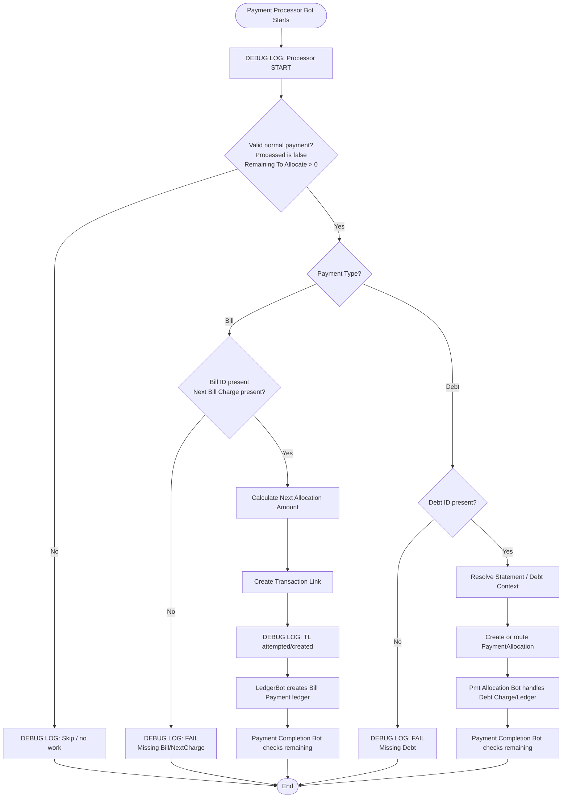

# 🤖 payment-processor-bot.md

> Last Updated: 2026-06-18
>
> Previous Name:
>
> - `New Payment Bot`
>
> Related Docs:
>
> - [payment-completion-bot.md](./payment-completion-bot.md)
> - [pmt-allocation-bot.md](./pmt-allocation-bot.md)
> - [ledger-system.md](../architecture/ledger-system.md)
> - [payment-allocation-process.md](./payment-allocation-process.md)
> - [transaction-links.md](../tables/transaction-links.md)
> - [bill-charges.md](../tables/bill-charges.md)
> - [payments.md](../tables/payments.md)
> - [ledger.md](../tables/ledger.md)

---

# 📌 Overview

## Purpose

The `Payment Processor Bot` is the renamed and refactored version of the old `New Payment Bot`.

Its job is to process a newly-entered or updated `Payments` row by creating the next allocation work item for that payment.

For bill payments, the work item is usually:

```text
Transaction Link
```

For debt payments, the work item is usually one of:

```text
PaymentAllocation
Debt refresh / payoff action
Statement repair action
```

The bot works together with `Payment Completion Bot` to create a loop:

```text
Payment Processor Bot
  ↓
Create one allocation row
  ↓
LedgerBot / Pmt Allocation Bot handles financial detail
  ↓
Payment Completion Bot checks remaining amount
  ↓
If more remains, re-trigger Payment Processor Bot
```

---

# 🧠 Design Philosophy

<details open>
<summary><strong>Expand Design Notes</strong></summary>

The `Payments` table represents:

```text
Payment intent / payment event
```

NOT:

```text
Bill Charge balance
Debt Charge balance
Ledger balance
```

Bill-side allocation detail belongs in:

```text
Transaction Links
```

Debt-side allocation detail belongs in:

```text
PaymentAllocations
```

Financial source-of-truth belongs in:

```text
Ledger
```

---

## Loop Philosophy

This bot should process only **one allocation unit per run**.

That keeps the bot safe, observable, and restartable.

A single payment can be larger than one bill charge. Example:

```text
Payment = $256.50
Bill Charge A remaining = $131.51
Bill Charge B remaining = $124.99
```

The payment loop should create two allocation rows, one per charge, instead of trying to write all allocation effects directly into the payment row.

---

## Ledger SSOT Philosophy

The `Payment Processor Bot` should not directly calculate final balances.

It should create allocation rows that downstream systems convert into ledger rows.

Preferred bill-side chain:

```text
Payments
  ↓
Transaction Links
  ↓
LedgerBot
  ↓
Ledger
  ↓
Bill Charges[Remaining Amount]
```

The `Bill Charges[Remaining Amount]` value should derive from `Ledger[Signed Amount]`, not directly from `Transaction Links` or `Adjustments`.

---

## Ownership Boundary

| System | Responsibility |
|---|---|
| Payments | Source payment event |
| Payment Processor Bot | Create next allocation unit |
| Transaction Links | Bill-side allocation detail |
| PaymentAllocations | Debt-side allocation detail |
| LedgerBot | Convert bill-side Transaction Links into Ledger rows |
| Pmt Allocation Bot | Convert debt-side PaymentAllocations into Debt Charges and Ledger rows |
| Payment Completion Bot | Decide complete vs continue |
| Ledger | Financial source of truth |

---

## Reversal Boundary

Returned payments and reversals should not be routed through this normal payment processor loop.

Use a separate reversal flow, such as:

```text
Payment Reversal Processor Bot
Payment Reversal Completion Bot
Reverse Allocations Bot
```

Normal payment allocation and reversal allocation have opposite ledger behavior and should stay separate.

</details>

---

# ⚙️ Trigger Configuration

<details open>
<summary><strong>Trigger Details</strong></summary>

## Event Type

```text
Adds and Updates
```

---

## Table

```text
Payments
```

---

## Current / Recommended Bot Condition

```appsheet
AND(
  [Processed] <> TRUE,
  [Amount Paid] > 0,
  [Remaining To Allocate] > 0,
  OR(
    AND(
      [Type] = "Bill",
      ISNOTBLANK([Bill ID])
    ),
    AND(
      [Type] = "Debt",
      ISNOTBLANK([Debt ID])
    )
  ),
  NOT(
    IN(
      [Payment Status],
      LIST(
        "Returned",
        "Reversed",
        "Reversal"
      )
    )
  )
)
```

---

## Bill Branch Condition

```appsheet
AND(
  [Type] = "Bill",
  ISNOTBLANK([Bill ID]),
  [Remaining To Allocate] > 0,
  ISNOTBLANK([Next Bill Charge ID])
)
```

---

## Debt Branch Condition

```appsheet
AND(
  [Type] = "Debt",
  ISNOTBLANK([Debt ID]),
  [Remaining To Allocate] > 0
)
```

---

## Important Trigger Note

If `[Remaining To Allocate]` is virtual, AppSheet may not trigger a bot only because that virtual value changes.

Use a physical loop-control column when needed, such as:

```text
Processor Tick
Allocation Iteration
Last Allocation Attempt At
Processing State
```

The `Payment Completion Bot` can update that physical field to re-trigger this bot.

</details>

---

# 🗂️ Tables Used

| Table | Purpose |
|---|---|
| Payments | Source payment row and loop state |
| Bills | Parent bill for bill payments |
| Bill Charges | Target charge rows for bill allocation |
| Transaction Links | Bill-side allocation detail |
| Ledger | Financial source of truth, written by LedgerBot |
| Debts | Parent debt for debt payments |
| Statements | Statement lookup for statement-based debts |
| PaymentAllocations | Debt-side allocation detail |
| Debug Log | Trace processing, failures, and loop state |

---

# 🔗 Related Actions

<details open>
<summary><strong>Expand Actions</strong></summary>

## Core Actions

- `Log Payment Processor Start`
- `Set Processing State`
- `Find Next Bill Charge`
- `Create Transaction Link`
- `Create Debt Allocation`
- `Repair Payment Statement`
- `Refresh Payment`
- `Log Payment Processor Finish`

---

## Bill Actions

- `Create Transaction Link`
- `Set Payment Bill Charge ID`
- `Mark Bill Payment Submitted`
- `Refresh Bill`
- `Update Bill Status`

---

## Debt Actions

- `Repair Payment Statement ID`
- `Create PaymentAllocation`
- `Refresh Debt`
- `Execute Debt Payoff`

---

## Guard / Repair Actions

- `Log Missing Next Bill Charge`
- `Log Missing Bill ID`
- `Log Missing Debt ID`
- `Log Remaining Amount Mismatch`
- `Clear Stuck Processing State`

</details>

---

# 🔄 High-Level Flow

<details open>
<summary><strong>Process Flow</strong></summary>

```text
Payment added or re-triggered
    ↓
Validate payment is normal payment, not reversal
    ↓
Check Remaining To Allocate
    ↓
Branch by Type
    ↓
Bill:
    Find next unpaid Bill Charge
    ↓
    Create one Transaction Link
    ↓
    LedgerBot creates bill payment ledger
    ↓
Debt:
    Resolve statement/debt context
    ↓
    Create or route PaymentAllocation
    ↓
    Pmt Allocation Bot creates debt-side ledger
    ↓
Payment Completion Bot checks whether payment is done
```

</details>

---

# 🧩 Mermaid Diagram

<details open>
<summary><strong>Expand Mermaid Diagram</strong></summary>



</details>

---

# 🧾 Step-by-Step Breakdown

<details open>
<summary><strong>Expand Detailed Steps</strong></summary>

# Step 1 — Bot Start

## Action

```text
Log Payment Processor Start
```

Purpose:

- establish TraceID
- identify payment row
- record current remaining amount
- identify whether this is first run or looped run

---

# Step 2 — Guard Normal Payment

## Condition

```appsheet
AND(
  [Processed] <> TRUE,
  [Amount Paid] > 0,
  [Remaining To Allocate] > 0
)
```

This bot should skip:

- already processed payments
- zero-dollar payments
- returned/reversed payments
- payment rows with no bill/debt target
- rows intentionally handled by reversal bots

---

# Step 3 — Bill Branch

## Condition

```appsheet
[Type] = "Bill"
```

Bill payments allocate into one or more `Bill Charges`.

The processor should select the next eligible unpaid charge and create one `Transaction Link`.

Preferred charge ordering:

```text
Oldest unpaid Bill Charge first
```

---

# Step 4 — Create One Transaction Link

A single processor run should create one row:

```text
Transaction Links
```

Required fields:

| Field | Value |
|---|---|
| `Payment ID` | Current payment |
| `Bill ID` | Current payment's Bill ID |
| `Bill Charge ID` | Next unpaid Bill Charge |
| `Amount Applied` | Next allocation amount |
| `Type` | `Bill` |
| `TraceID` | Current Payment ID, when available |

---

# Step 5 — LedgerBot Handles Ledger

The processor should not directly create the bill payment ledger row if `LedgerBot` is active.

Preferred downstream chain:

```text
Transaction Link added
    ↓
LedgerBot
    ↓
Ledger row Type = Bill Payment
```

Ledger row requirements:

| Ledger field | Value |
|---|---|
| `Type` | `Bill Payment` |
| `Amount` | Transaction Link amount |
| `Signed Amount` | Negative amount |
| `PaymentID` | Source payment |
| `Bill ID` | Source bill |
| `Bill Charge ID` | Source Bill Charge |
| `TransLink` | Source Transaction Link |

---

# Step 6 — Debt Branch

## Condition

```appsheet
[Type] = "Debt"
```

Debt payments should use debt-specific allocation logic.

Statement-based debt allocation should flow through:

```text
PaymentAllocations
  ↓
Pmt Allocation Bot
  ↓
Debt Charges / Ledger
```

The processor may still perform generic debt refresh actions, but should not duplicate ledger effects already handled by `Pmt Allocation Bot`.

---

# Step 7 — Hand Off To Completion

After creating the allocation unit, the processor should hand off to:

```text
Payment Completion Bot
```

The completion bot determines whether to:

- mark payment processed
- update bill/debt statuses
- or re-trigger this processor for another allocation loop

</details>

---

# 🧮 Formula Reference

<details open>
<summary><strong>Expand Formula Reference</strong></summary>

# Remaining To Allocate

Use a physical or virtual column on `Payments`.

Bill-side version:

```appsheet
IF(
  [Amount Paid]
  - SUM(
    SELECT(
      Transaction Links[Amount Applied],
      [Payment ID] = [_THISROW].[Row ID]
    )
  )
  > 0,
  [Amount Paid]
  - SUM(
    SELECT(
      Transaction Links[Amount Applied],
      [Payment ID] = [_THISROW].[Row ID]
    )
  ),
  0
)
```

---

# Next Bill Charge ID

```appsheet
ANY(
  ORDERBY(
    SELECT(
      Bill Charges[Row ID],
      AND(
        [Bill ID] = [_THISROW].[Bill ID],
        [Remaining Amount] > 0
      )
    ),
    [CycleStart],
    TRUE
  )
)
```

If `CycleStart` is not populated for older rows, use the charge `Date` or due-date equivalent as the sort field.

---

# Next Allocation Amount

```appsheet
IF(
  [Remaining To Allocate] <= [Next Bill Charge ID].[Remaining Amount],
  [Remaining To Allocate],
  [Next Bill Charge ID].[Remaining Amount]
)
```

---

# Create Transaction Link Guard

```appsheet
AND(
  [Type] = "Bill",
  [Remaining To Allocate] > 0,
  ISNOTBLANK([Next Bill Charge ID]),
  [Next Allocation Amount] > 0
)
```

---

# Processor Should Skip Returned Payment

```appsheet
NOT(
  IN(
    [Payment Status],
    LIST(
      "Returned",
      "Reversed",
      "Reversal"
    )
  )
)
```

If the app uses `[Reversal Multiplier]`, normal processor rows should usually have:

```appsheet
[Reversal Multiplier] = 1
```

</details>

---

# 🧪 Testing Checklist

<details open>
<summary><strong>Expand Testing Checklist</strong></summary>

## Bill Allocation Tests

- [ ] New bill payment creates exactly one Transaction Link on first run
- [ ] Overpayment across multiple Bill Charges creates one Transaction Link per loop
- [ ] Oldest unpaid Bill Charge is selected first
- [ ] `Amount Applied` never exceeds payment remaining amount
- [ ] `Amount Applied` never exceeds target Bill Charge remaining amount
- [ ] Payment with no next charge logs FAIL instead of creating blank rows

---

## Ledger SSOT Tests

- [ ] Processor does not create duplicate Ledger rows
- [ ] LedgerBot creates one Bill Payment ledger row per Transaction Link
- [ ] Ledger row includes `PaymentID`, `Bill ID`, `Bill Charge ID`, and `TransLink`
- [ ] Bill Charge remaining amount changes only through Ledger SSOT math

---

## Debt Tests

- [ ] Debt payment does not create bill Transaction Links
- [ ] Statement-based loan debt payment routes through PaymentAllocations
- [ ] Debt refresh actions do not duplicate ledger effects
- [ ] Debt payoff logic runs only after balance is truly zero

---

## Loop Tests

- [ ] Payment with remaining amount after first allocation re-triggers
- [ ] Payment with no remaining amount does not re-trigger
- [ ] Completion bot marks processed only after ledger-backed allocation is complete
- [ ] Stuck payments can be identified through Debug Log

---

## Reversal Tests

- [ ] Returned payment does not enter normal processor loop
- [ ] Reversal payment uses separate reversal flow
- [ ] Normal processor never creates positive reversal ledger rows

</details>

---

# 🐞 Debug Logging

<details open>
<summary><strong>Expand Debug Logging</strong></summary>

# Standard Format

```text
[Process] | [Stage] | [Status] | [SourceTable]:[Row Identifier] | [Summary]
```

---

# Details Format

```text
Charge=<<[Next Bill Charge ID]>> | Amt=<<[Next Allocation Amount]>> | Remaining=<<[Remaining To Allocate]>>
```

---

# Example Messages

## Start

```text
Payment | Allocation | START | Payment:<<[Row ID]>> | Begin allocation loop
```

---

## Transaction Link Attempt

```text
Payment | Create TL | START | Payment:<<[Row ID]>> | Attempting allocation
```

---

## Transaction Link Created

```text
Payment | Create TL | SUCCESS | Payment:<<[Row ID]>> | TL Created: <<[TransLinkID]>>
```

---

## Missing Next Charge

```text
Payment | Create TL | FAIL | Payment:<<[Row ID]>> | NextChargeID was blank
```

---

## Finish

```text
Payment | Processor | SUCCESS | Payment:<<[Row ID]>> | Processor handoff complete
```

</details>

---

# ⚠️ Known Issues / Edge Cases

<details open>
<summary><strong>Expand Known Issues</strong></summary>

# Virtual Column Trigger Risk

If `[Remaining To Allocate]` is virtual, the bot may not re-run merely because a related Transaction Link or Ledger row changed.

Use a physical trigger/tick column for loop control if needed.

---

# Ledger Timing Risk

If `Bill Charges[Remaining Amount]` now derives from Ledger, the completion bot should not finalize until the expected ledger row exists.

Sequence matters:

```text
Transaction Link created
    ↓
Ledger row created
    ↓
Completion check runs
```

---

# Duplicate Ledger Risk

Do not create Ledger rows from both:

```text
Payment Processor Bot
```

and:

```text
LedgerBot
```

for the same Transaction Link.

Exactly one real-world financial event should produce exactly one ledger effect.

---

# Reversal Contamination

Returned payments and normal payments should not share the same processor loop.

Reversals need separate positive ledger logic.

---

# Blank Transaction Link Risk

If `Next Bill Charge ID`, `Bill ID`, or `Amount Applied` are blank, do not create a Transaction Link.

Log a failure and leave the payment unprocessed for repair.

</details>

---

# 🚀 Future Improvements

<details open>
<summary><strong>Expand Future Improvements</strong></summary>

- [ ] Add physical `Processing State` column
- [ ] Add physical `Allocation Iteration` column
- [ ] Add physical `Last Allocation Attempt At` timestamp
- [ ] Add processor retry limit
- [ ] Add stuck payment dashboard
- [ ] Add duplicate Transaction Link detector
- [ ] Add missing Ledger detector
- [ ] Split normal processor and reversal processor completely

</details>

---

# 🔍 Cross References

## Related Bots

- Payment Completion Bot
- LedgerBot
- Pmt Allocation Bot
- Payment Repair Bot
- George Bot
- New Debt Charge Bot
- Payment Reversal Processor Bot

---

## Related Systems

- Ledger System
- Bill Charge Allocation System
- Transaction Link System
- Statement Reconciliation
- Loan Payment Allocation
- Reversal Handling

---

# 📚 Change History

<details open>
<summary><strong>Expand Change History</strong></summary>

| Date | Change |
|---|---|
| 2026-06-18 | Created documentation for renamed `Payment Processor Bot` |
| 2026-06-18 | Documented relationship to former `New Payment Bot` |
| 2026-06-18 | Added Processor/Completion loop model |
| 2026-06-18 | Added Ledger SSOT and LedgerBot ownership rules |
| 2026-06-18 | Added reversal boundary notes |

</details>
