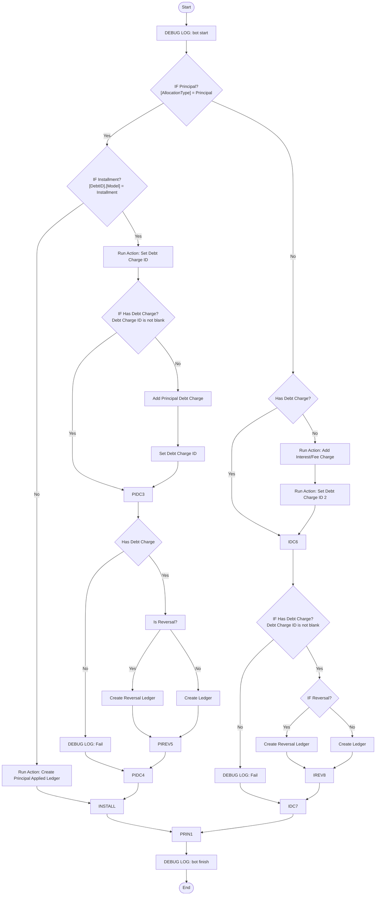

# 🤖 pmt-allocation-bot.md

> Last Updated: 2026-05-08
>
> Related Docs:
>
> - [loan-statement-process-repair-plan.md](./loan-statement-process-repair-plan.md)
> - [statement-bot.md](./statement-bot.md)
> - [ledger-system.md](../architecture/ledger-system.md)
> - [payment-allocation-process.md](./payment-allocation-process.md)

---

# 📌 Overview

## Purpose

The `Pmt Allocation Bot` processes newly-created `PaymentAllocations` rows and converts them into:

- Linked Debt Charges
- Ledger entries
- Principal reductions
- Interest/Fee payment tracking
- Installment tracking records

This bot is one of the core financial orchestration systems inside CashSnap.

---

# 🧠 Design Philosophy

<details open>
<summary><strong>Expand Design Notes</strong></summary>

The `PaymentAllocations` table represents:

```text
Applied split records
```

NOT:

```text
Charges owed
```

Charges owed belong in:

```text
Debt Charges
```

Financial movement belongs in:

```text
Ledger
```

---

## Statement-Based Loan Philosophy

For:

```text
Loan (Statement-Based)
```

Principal allocations SHOULD:

- create `Principal Applied` ledger rows
- reduce `Principal_Balance`
- NOT create Debt Charges

Interest/Fee allocations SHOULD:

- create or link Debt Charges
- create payment-side ledger rows
- affect `Interest_Balance`

---

## Installment Philosophy

For:

```text
Installment
```

Principal MAY use Debt Charges because installment schedules behave more like scheduled obligations than rolling balances.

---

## Core Ownership Boundary

| System | Responsibility |
|---|---|
| Statements | Statement periods |
| Loan_Pmt_Splits | Split instructions |
| PaymentAllocations | Applied split records |
| Debt Charges | Charges owed |
| Ledger | Financial source of truth |

</details>

---

# ⚙️ Trigger Configuration

<details open>
<summary><strong>Trigger Details</strong></summary>

## Event Type

```text
Adds Only
```

---

## Table

```text
PaymentAllocations
```

---

## Bot Condition

```appsheet
TRUE
```

Future optimization may narrow this condition.

</details>

---

# 🗂️ Tables Used

| Table | Purpose |
|---|---|
| PaymentAllocations | Source split records |
| Debt Charges | Interest/Fee obligations |
| Ledger | Financial movement |
| Statements | Statement ranges |
| Debts | Debt model lookup |
| Payments | Original payment source |
| Installment Schedule | Scheduled installment obligations |

---

# 🔗 Related Actions

<details open>
<summary><strong>Expand Actions</strong></summary>

## Core Actions

- `Set Debt Charge ID`
- `Set Debt Charge ID 2`
- `Add Interest/Fee Charge`
- `Add Principal Debt Charge`
- `Create Ledger`
- `Create Principal Applied Ledger`

---

## Repair Actions

- `Repair Ledger Missing Fields`
- `Repair Missing Debt Charge Links`
- `Repair Missing Principal Ledgers`

</details>

---

# 🔄 High-Level Flow

<details open>
<summary><strong>Process Flow</strong></summary>

```text
PaymentAllocation Added
    ↓
Determine AllocationType
    ↓
Determine Debt Model
    ↓
Find/Create Debt Charge if needed
    ↓
Create Ledger movement
    ↓
Finalize + Log
```

</details>

---

# 🧩 Mermaid Diagram

<details open>
<summary><strong>Expand Mermaid Diagram</strong></summary>

Paste/update your latest Mermaid diagram below.



</details>

---

# 🧾 Step-by-Step Breakdown

<details open>
<summary><strong>Expand Detailed Steps</strong></summary>

# Step 1 — Bot Start

## Action

```text
DEBUG LOG: bot start
```

Purpose:

- trace execution
- identify duplicate runs
- establish ProcessRunID / TraceID

---

# Step 2 — Principal Check

## Condition

```appsheet
[AllocationType] = "Principal"
```

---

## YES → Principal Branch

Principal behavior depends on Debt Model.

---

### Installment Principal

```appsheet
[DebtID].[Model] = "Installment"
```

Behavior:

- principal MAY use Debt Charges
- principal MAY map to Installment Schedule rows

Flow:

```text
Set Debt Charge ID
    ↓
If missing:
    Add Principal Debt Charge
    ↓
Set Debt Charge ID 2
    ↓
Create Ledger
```

---

### Loan (Statement-Based) Principal

Behavior:

- NO Debt Charge
- create Principal Applied ledger only

Flow:

```text
Create Principal Applied Ledger
```

---

## NO → Interest/Fee Branch

Flow:

```text
Set Debt Charge ID
    ↓
If missing:
    Add Interest/Fee Charge
    ↓
Set Debt Charge ID 2
    ↓
Create Ledger
```

Interest/Fee SHOULD:

- create or link Debt Charges
- create payment-side Ledger rows
- affect Interest_Balance

</details>

---

# 🧮 Formula Reference

<details open>
<summary><strong>Expand Formula Reference</strong></summary>

# Allocation Role

```appsheet
IFS(
  [Is Reversal?] = TRUE,
    "Reversal",

  [Is Correction?] = TRUE,
    "Correction",

  AND(
    [DebtID].[Model] = "Installment",
    [AllocationType] = "Principal",
    ISNOTBLANK([Installment Schedule ID])
  ),
    "Scheduled",

  TRUE,
    "Extra"
)
```

---

# Counts Towards Installment?

```appsheet
AND(
  [DebtID].[Model] = "Installment",
  [AllocationType] = "Principal"
)
```

---

# Charge Category

```appsheet
IFS(
  ISNOTBLANK([Debt Charge ID]),
    [Debt Charge ID].[ChargeType],

  IN([AllocationType], LIST("Interest", "Fee")),
    [AllocationType],

  TRUE,
    ""
)
```

---

# Statement ID Resolution

```appsheet
IF(
  ISNOTBLANK([StatementID]),
  [StatementID],
  IF(
    IN(
      [DebtID].[Model],
      LIST(
        "Loan (Statement-Based)",
        "Credit Card",
        "Credit Card (Statement-Based)"
      )
    ),
    ANY(
      ORDERBY(
        SELECT(
          Statements[Row ID],
          AND(
            [Debt_ID] = [_THISROW].[DebtID],
            [_THISROW].[PaymentID].[Date] >= [Statement_Start],
            [_THISROW].[PaymentID].[Date] <= [Statement_End]
          )
        ),
        [Statement_End],
        FALSE
      )
    ),
    ""
  )
)
```

</details>

---

# 🧪 Testing Checklist

<details open>
<summary><strong>Expand Testing Checklist</strong></summary>

## Principal Tests

- [ ] Statement-based principal creates NO Debt Charge
- [ ] Statement-based principal creates Principal Applied ledger
- [ ] Installment principal can create/link Debt Charge
- [ ] Principal Balance decreases correctly

---

## Interest/Fee Tests

- [ ] Interest creates or links Debt Charge
- [ ] Fee creates or links Debt Charge
- [ ] No duplicate Interest Charges created
- [ ] Interest_Balance calculates correctly

---

## Integrity Tests

- [ ] No orphan Ledger rows
- [ ] No orphan PaymentAllocations
- [ ] No duplicate Principal Applied ledgers
- [ ] No duplicate Debt Charges
- [ ] Statement links populate correctly

---

## Reversal Tests

- [ ] Reversal allocations create reversal ledgers
- [ ] Reversal rows do not duplicate charges
- [ ] Signed Amount logic remains correct

</details>

---

# 🐞 Debug Logging

<details open>
<summary><strong>Expand Debug Logging</strong></summary>

# Standard Format

```text
[Process] | [Stage] | [Status] | [SourceTable]:[Row Identifier] | [Summary]
```

---

# Example Messages

## Start

```text
[Pmt Allocation] | [Start] | [START] | [PaymentAllocation]:abc123 | Bot triggered
```

---

## Interest Charge Created

```text
[Pmt Allocation] | [Debt Charge] | [SUCCESS] | [DebtCharge]:xyz789 | Interest charge created
```

---

## Principal Ledger Created

```text
[Pmt Allocation] | [Ledger] | [SUCCESS] | [Ledger]:xyz789 | Principal Applied ledger created
```

---

## Failure

```text
[Pmt Allocation] | [Debt Charge] | [FAIL] | [PaymentAllocation]:abc123 | Debt Charge not found
```

</details>

---

# ⚠️ Known Issues / Edge Cases

<details open>
<summary><strong>Expand Known Issues</strong></summary>

# Historical Duplicate Interest Issue

Historically:

```text
Loan_Pmt_Splits
```

AND:

```text
PaymentAllocations
```

both created Interest Debt Charges.

This caused:

- duplicate charges
- duplicate ledgers
- inflated balances
- incorrect Remaining Balance calculations

The old:

```text
Split Happens
```

bot path has now been disabled.

---

# Principal Charge Differences

| Model | Principal Uses Debt Charge? |
|---|---|
| Loan (Statement-Based) | NO |
| Installment | YES |

---

# Common Failure Cases

- Missing StatementID
- Missing Debt Charge links
- Duplicate Principal Applied ledgers
- Reversal timing mismatch
- Missing Installment Schedule links

</details>

---

# 🚀 Future Improvements

<details open>
<summary><strong>Expand Future Improvements</strong></summary>

- [ ] Add integrity validator
- [ ] Add self-healing repair mode
- [ ] Add duplicate-charge detector
- [ ] Reduce redundant lookups
- [ ] Improve bot performance
- [ ] Reduce Debug Log spam
- [ ] Add Transaction Link support for split allocations

</details>

---

# 🔍 Cross References

## Related Bots

- Loan Statement Bot
- Statement Bot
- Payment Repair Bot
- LedgerBot
- New Debt Charge Bot

---

## Related Systems

- Ledger System
- Statement Reconciliation
- Installment Schedule System
- Loan Statement Process Repair Plan

---

# 📚 Change History

<details open>
<summary><strong>Expand Change History</strong></summary>

| Date | Change |
|---|---|
| 2026-05-08 | Refactored into standardized bot documentation template |
| 2026-05-08 | Added statement-based loan principal handling |
| 2026-05-08 | Added Installment principal charge logic |
| 2026-05-08 | Added Mermaid diagram placeholder |

</details>